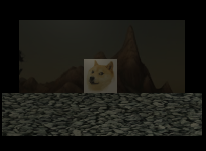
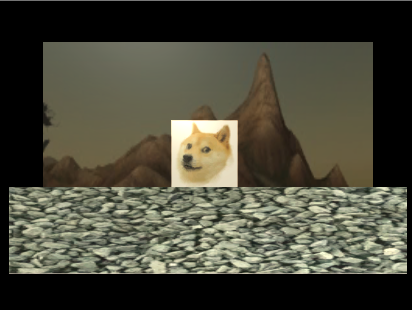
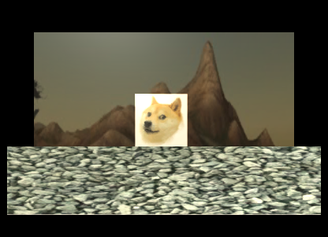

# introduction
	simple 2D day and night transition effect implement in Unity.

# principle
1 use color*float4(float3(n),1) to make camera image darker;
2 transition
    use Time.deltaTime as time interval
3 use depth information to implement a fact that:

    near object 's reaction to light change is bigger than far object's.
# final result:

